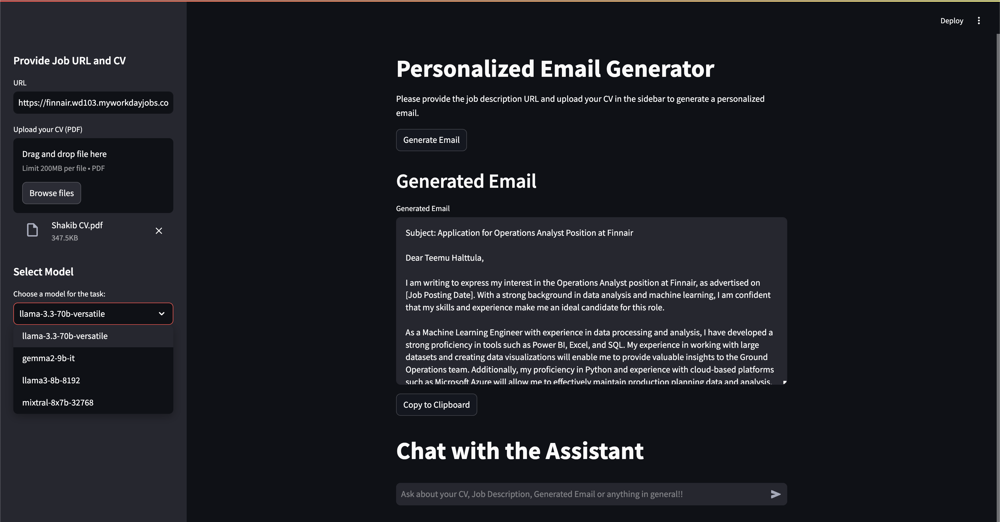

# Personalized Email Generator with LLM feedback

#### Project Description

- **Personalized Email Generation**: Developed an application to automate personalized email writing for job applications using advanced language models, dynamically adapting to job descriptions and candidate CVs.  
- **Interactive Streamlit Interface**: Designed a user-friendly interface allowing users to input job URLs, upload CVs, and select language models, ensuring a seamless experience for non-technical users.  
- **Dynamic Model Selection**: Integrated multiple state-of-the-art models like LLaMA and GEMMA, enabling flexible selection based on specific email generation requirements.  
- **Job and CV Content Analysis**: Implemented detailed analysis of job descriptions and CVs using LangChain for precise information extraction, relevance determination, and email personalization.  
- **Professional Assistant Chat**: Added a real-time chat feature powered by advanced prompting, assisting users with inquiries related to the generated email, job descriptions, or CVs.  

#### Screenshot

